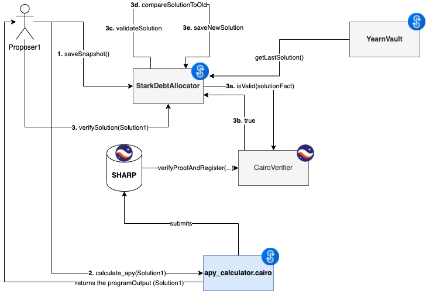

# StarkDebtAllocator
The objective of this PoC is decentralizing even more the process to choose strategy weights within a vault. 

StarkDebtAllocator is the contract in charge of receiving and validating debt ratio proposals, that will come from any proposer.  

It uses (zk-)STARKS through Starware's Cairo, SHARP prover and L1 verifier to generate proofs that make it possible to be sure that they are valid solutions without spending a ton of gas running the computation on-chain.	

To incentivize people running the calculations and proposing solutions, the solution proposer will earn rewards during the time their solution is used. 	

## Intro	
Currently, debt ratios are proposed by vault managers and approved by a multisig. Vault managers analyze how each of the strategies is performing, checking their different APYs and then come up with a set of debt ratios, which are set manually. 

{	
    "strategy1": 2500,
    "strategy2": 2500,
    "strategy3": 3500,	
    "strategy4": 1500	
}	

This process requires manual intervention and brings a lot of overhead with it.	

## Solution	
The PoC is composed of 2 parts: L1 smart contract and Cairo Program	

StarkDebtAllocator is one Ethereum L1 smart contract. 	

It implements three main components:
- add/update/remove strategy():	Give all the necessary info to get on-chain data for a strategy, hash them all and save the hash
- saveSnapshot(): reads all the on-chain data that will be used as inputs for the Cairo Program and hashes them all, then saves the hash. 
- verifySolution(uint256[] programOutput): 	
	- Check not staled Snapshot (we need to make sure we calculate the APY with fresh data)
	- parses programOutput to the following values: inputsHash (to check if data used in the cairo program are valid), currentTargetAllocation, newTargetAllocation, current_solution and new_solution.
 (Note that cairo felt isn't big enought to support 256 bits (252 bits max), that's why 2 slot of the programOutput are used to calculate the input hash from strategies input, 128 bits each)	
	- checks that the new solution is better than the previous solution, for user experience purpose, a minimum increase is necessary so the proposer won't change for a certain moment. Also the current solution is calculated in the cairo script better than the saved one in storage so we make sure we get real the current APY (with valid inputs).
	- checks that the CairoVerifier from Starkware has received the proof and confirmed it is correct	
	- sets the new winning solution, the new debt ratio array and store the address of the user and his performance.	
	- Then we can rewards the last proposer with llamapay

apy_calculator.cairo is the Cairo program that takes the on-chain data from save-snapshot and calculates the APR for the current TargetAllocation and the new TargetAllocation. This Cairo program will also compute a hash of all the inputs it has used to calculate APYs to send it to the L1 smart contract, so inputs can be validated. 	

## Details	
	

## Requirements

Python 3.9 +, we recommand to use a env var

pip install -r requirements.txt

Or manually: 
Setup Cairo https://www.cairo-lang.org/docs/quickstart.html
Setup Ape https://docs.apeworx.io/ape/stable/userguides/quickstart.html
Setup Web3 https://web3py.readthedocs.io/en/v5/quickstart.html

## Test

ape run test

## Script	

Exemple: Testnet goerli with Aave and Compound Lending

Follow these steps: 	

- ape accounts import <account_name> and add your private key 

- Fill the .env :
ACCOUNT_ALIAS=  <account_name>
BIN_PATH=  EXEMPLE: "/Users/sacha/cairo_venv/bin"
STEPS_LIMIT=1000000 
NODE_RPC_URL= YOUR GOERLI RPC

- ape run deploy_debt_allocator. Once executed add the deployed address in config_testnet at "debt_allocator_address"

- from scripts/setup/testnet, move add_AaveV2_strategy and add_CompoundV2_strategy to scripts/

- ape run setup  (setup has to be executed before each step, it will index strategies data from the last events, as this data is not stored directly in the contract for gas optimization)

- ape run add_AaveV2_strategy --network ethereum:goerli:infura   (or your own provider)

- ape run setup

- ape run add_CompoundV2_strategy --network ethereum:goerli:infura  

-  add the wanted assets amount in config_testnet at  "new_allocation_array" (don't forget decimals) [50000000, 70000000], 50 USDC + 70 USDC

- ape run setup --network ethereum:goerli:infura  

- ape run full_ops
This last step will take a snapshot, run the cairo program with data taken from snapshot event, submit to the sharp the proof of execution and wait until the job is processed (be patient, it can takes until 15 minutes). Once processed, the solution will be verified and you'll be rewarded as the new proposer! 

## Calculation Logic

Each Strategy APY is calculated in the cairo program hash. Better than modifying the cairo program every time a new strategy is added (which involves modifying the cairo program hash on the debtAllocator contract), the strategy APY calculation is given as an input. 

The calculation follow this logic: 

Each step performs an operation of 2 operands.
The operand is between 0 and 10000, we take the value of the input data
The operand is between 10000 and 20000, we take the value of the last calculation steps.
The operand is more than 20000, we take the value - 20 000
the operation is described by a uint, 0 = +, 1 = -, 2 = x, 3 = /

Exemple for a strategy: 
Input: [4,7,2]
Calculation_logic: [4, 1,0,0, 10000,2,2, 10001,20010,1, 10002,2,3]

step0 -> 7(input 1) + 4 (input 0)

step1 -> 11 (step0) * 2 (input 2)

step2 -> 22 (step1) - 10 (20010 - 20000)

step3 -> 12(step2) / 2 (input 2)

res = 6 ✨

The Strategy APR can be different following some conditions.

The cairo script can perfom calculations and check if the last step is lower or equal to a value. If it does, a new calculation tab is extracted from the original one, following the offset and the new calculation len.

Condition logic: [2, 0, 2, 2, 1, 20002, 1, 10001, 10000, 26, 20]

Step 0 ->  4 (input 0) x 2 (input 2)

Step 1 ->  7 (input 1) - 2 (20002 - 20000)

FinalStep ->  5(step1) <= 8(step0) ? 
oui -> jump offset 26 and tab len = 20

Jump into scripts/setup/tutorial_addStrategy.txt to know more! 

## Add a new Strategy! 

To add a new strategy, the first step is to know about all the on-chain data you need to calculate your strategy APR.
You need for each data: The contract address, the selector(4bytes), the calldata (32bytes array), the offset (maybe the returned data is a tupple so you need to select the good arg).
Once you have all the required data, write your calculation and conditions step. 
When you are ready, write a script in the same format than scripts/setup/testnet/add_AaveV2_strategy.py

## To improve

- Verify solution doesn't check if the current target solution from the cairo output is the same as the one stored and it doesn't check the new neither, that should be equal to each strategy real amount of tokens. 

- Add test for LLamapay 

- Add new strategies ! 

